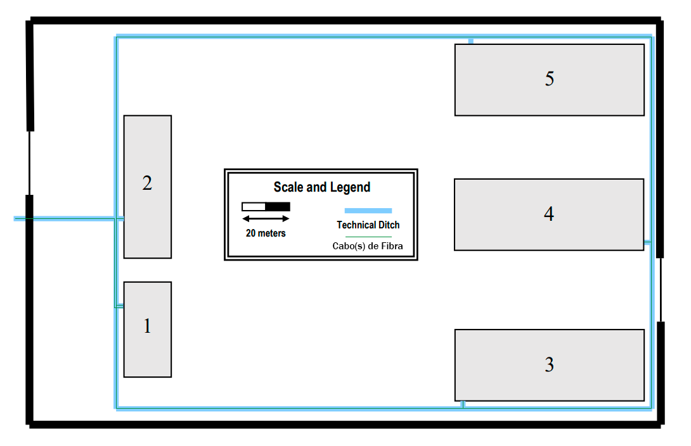
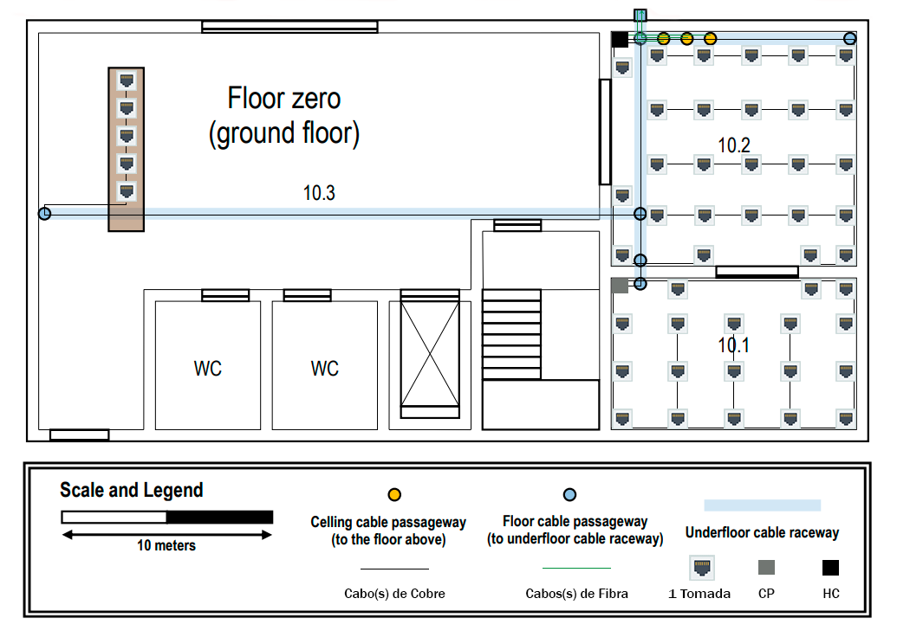
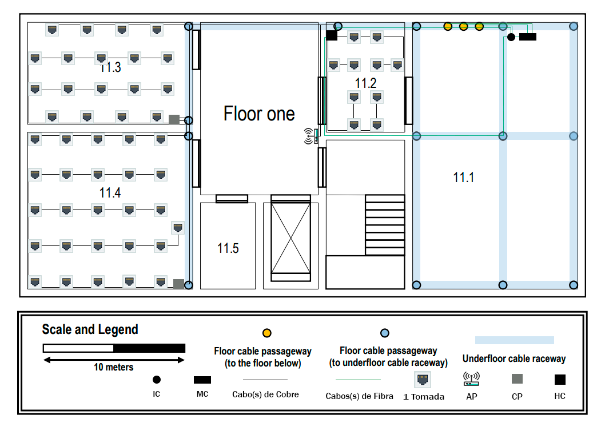

RCOMP 2019-2020 Project - Sprint 1 - Member 1190633 folder
==========================================================

# Ligações entre os Edifícios

* Visto que no meu edifício se encontra a **Data Center**, sala 11.1, tenho a responsabilidade de fazer a ligação entre o meu edifício e os restantes, ou seja a ligação entre o **MC (Main cross-connect)** e os **ICs (Intermediates cross-connect)** dos restantes edifícios.

### Representação

**Nota:** Os cabos de fibra colocados pela **entidade externa** estão representados apenas para uma melhor compreensão mas **não serão contabilizados**.

### Informações

| Ligação entre Edifícios | Comprimento Cabo Fibra (m) (1) |
|:----------------------- |:------------------------------ |
|1 ==> 2                  |809,78                          |
|1 ==> 3                  |793,72                          |
|1 ==> 4                  |906,04                          |

**(1)** Relativo à ligação entre **MC (Main cross-connect)**, que se encontra na **sala 11.1**, e os **ICs (Intermediates cross-connect)** de cada edifício.

### Inventário

* 2510 metros de Cabo de Fibra Ótica Monomodo
  > 743,53 metros entre 1 e 2 por baixo
  >
  > 66,25 metros entre 1 e 2 por cima
  >
  > 206,02 metros entre 1 e 3 por baixo
  >
  > 587,70 metros entre 1 e 3 por cima
  >
  > 408,73 metros entre 1 e 4 por baixo
  >
  > 497,31 metros entre 1 e 4 por cima

### Explicações

* Utilizei **Cabo de Fibra Ótica Monomodo**, porque é **imune à dispersão** e, portanto, permite **taxas de dados mais altas** e
especialmente **comprimentos de cabo mais longos**.

* Apliquei a **redundância** por **caminhos diferentes**, com a utilização de **2 cabos**, na ligação entre **MC (Main cross-connect)** e **IC (Intermediate cross-connect)** não só para o **balanceamento de carga** mas também para caso exista alguma **obstrução** em um dos caminho, visto que os 2 cabos vão por caminhos diferentes, temos sempre a **ligação pelo o outro caminho**.

# Edifício A

## Piso 0

### Representação

**Nota 1:** Os cabos representados **perto e paralelos** à parede representam **cabos na parede cobertos por calhas**, assim como as **tomadas junto à parede** significam que elas **estão colocadas na mesma**. Já os cabos que estão representados **paralelos à porta** significam que a estão a **contornar**. Relativamente às tomadas colocadas para o **meio da sala** podemos considerar que estão posicionadas no **centro da sua imagem** e todos os **cabos que as ligam** também estão **cobertos com calhas**.

**Nota 2:** Os cabos de fibra colocados pela **entidade externa** estão representados apenas para uma melhor compreensão mas **não serão contabilizados**.

### Informações

| Sala | Área (m^2) | Tomadas | CP | HC | Comprimento Cabo Cobre (m) (1) | Comprimento Cabo Fibra (m) (1) | Comprimento Calha Branca (m) | Comprimento Calha Meia Lua (m) |
|:---- |:---------- |:------- |:-- |:-- |:------------------------------ |:------------------------------ |:---------------------------- |:------------------------------ |
|10.1  |82,3242     |18       |1   |0   |228,80                          |0                               |43,74                         |14,19                           |
|10.2  |127,6224    |26       |0   |1   |367,06                          |22,76                           |18,77                         |38,49                           |
|10.3  |331,9515    |5        |0   |0   |223,55                          |0                               |5,89                          |4,29                            |

**(1)** A contabilização do comprimento de cobre/fibra entra na sala onde o cabo termina. ***Exemplo:*** Os cabos da sala 10.3 começam no HC (Horizontal cross-connect) da sala 10.2 mas como terminam na sala 10.3 a contabilização em metros vai entrar na sala 10.3.

### Inventário

* 1 HC (Horizontal cross-connect) (sala 10.2)
  > 1 Switch 48 portas
  >
  > 1 Patch Panel 48 portas de Cobre - CAT6
  >
  > 32 Patch Cords de Cobre - CAT6 (26 Tomadas + 5 Tomadas + 1 Ligação CP)
  >
  > Bastidor de Telecomunicação de Tamanho 6U
* 1 CP (Consolidation Points) (sala 10.1)
  > 1 Switch 24 portas
  >
  > 1 Patch Panel 24 portas de Cobre - CAT6
  >
  > 18 Patch Cords de Cobre - CAT6 (18 Tomadas)
  >
  > Bastidor de Telecomunicação de Tamanho 3U
* 49 Tomadas
* 820 metros de Cabo de Cobre - CAT6
* 23 metros de Cabo de Fibra Ótica Monomodo
* 69 metros de Calha Branca (Calha na Parede)
* 57 metros de Calha Meia Lua (Calha no Chão)

### Explicações

* Como temos **49 tomadas**, neste piso, vamos precisar no mínimo de **49 cabos**. Sendo que temos um **HC (Horizontal cross-connect)** com **1 Switch de 48 portas** vamos precisar de um **CP (Consolidation Points)** com **1 Switch de 24 portas** para conseguirmos conseguir fazer as **distribuições das tomadas** pelas salas.

* Optei por colocar o **HC (Horizontal cross-connect)** na **sala 10.2**, porque é a sala que tem acesso ao piso de cima e assim gastamos **menos cabo de fibra**.

* Optei por colocar o **CP (Consolidation Points)** na **sala 10.1** visto que assim podemos usar **32 portas do Switch** do **HC (Horizontal cross-connect)** para o **balcão da sala 10.3** (5 portas), para a **sala 10.2** (26 portas) e para o **CP (Consolidation Points)** (1 porta). Assim, o **CP (Consolidation Points)** fica responsável apenas pela distribuição de cabos na **sala 10.1** (18 tomadas).

* Apliquei a **redundância**, com a utilização de **2 cabos**, na ligação entre **IC (Intermediate cross-connect)** e **HC (Horizontal cross-connect)** para o balanceamento de carga.

* Utilizei **Cabos de Fibra Ótica Monomodo** até o **HC (Horizontal cross-connect)**, porque é **imune à dispersão** e, portanto, permite **taxas de dados mais altas** e
especialmente **comprimentos de cabo mais longos** e porque o **HC (Horizontal cross-connect)** é o **fim do Backbone**, ou seja é ele que fica responsável pelo piso. A partir do **HC (Horizontal cross-connect)** utilizei apenas **Cabos de Cobre - CAT6** pois não há um **número elevado de tomadas** que possa provocar um **alto nível de trafego de dados**, logo não justifica a utilização de **CAT7**.

* A calha no **balcão** da **sala 10.3** é aplicada por **baixo** do mesmo, para não ficar à vista.

* Realizando esta estrutura de cabos sobram ainda **14 portas** do **HC (Horizontal cross-connect)** e **5 portas** do **CP (Consolidation Points)** para futuras melhorias.

## Piso 1

### Representação

**Nota 1:** Os cabos representados **perto e paralelos** à parede representam **cabos na parede cobertos por calhas**, assim como as **tomadas junto à parede** significam que elas **estão colocadas na mesma**. Já os cabos que estão representados **paralelos à porta** significam que a estão a **contornar**. Relativamente às tomadas colocadas para o **meio da sala** podemos considerar que estão posicionadas no **centro da sua imagem** e todos os **cabos que as ligam** também estão **cobertos com calhas**.

**Nota 2:** Os cabos de fibra colocados pela **entidade externa** estão representados apenas para uma melhor compreensão mas **não serão contabilizados**.

### Informações

|Sala| Área (m^2) | Tomadas | CP | HC | AP | IC | MC | Comprimento Cabo Cobre (m) (1) | Comprimento Cabo Fibra (m) (1) | Comprimento Calha Branca (m) |Comprimento Calha Meia Lua (m)|
|:-- |:---------- |:------- |:-- |:-- |:-- |:-- |:-- |:------------------------------ |:------------------------------ |:---------------------------- |:---------------------------- |
|11.1|216,5625    |0        |0   |0   |0   |1   |1   |0                               |1,74                            |0,26                          |6,93                          |
|11.2|42,8352     |10       |0   |1   |1   |0   |0   |100,56 (2)                      |41,04                           |16,31                         |13,55                         |
|11.3|89,9772     |18       |1   |0   |0   |0   |0   |278,30                          |0                               |24,23                         |19,28                         |
|11.4|129,4203    |26       |1   |0   |0   |0   |0   |359,75                          |0                               |29,19                         |28,87                         |
|11.5|23,7290     |0        |0   |0   |0   |0   |0   |0                               |0                               |0                             |0                             |

**(1)** A contabilização do comprimento de cobre/fibra entra na sala onde o cabo termina. ***Exemplo:***  Alguns cabos da sala 11.3 começam no HC (Horizontal cross-connect) da sala 11.2 mas como terminam na sala 11.3 a contabilização em metros vai entrar na sala 11.3.

**(2)** Entra aqui a contabilização de metros de cabo da ligação entre o HC (Horizontal cross-connect) e o AP (Access Point).

### Inventário

* 1 MC (Main cross-connect) (sala 11.1)
  > 1 Patch Panel 24 portas de FIbra Ótica Monomodo
  >
  > 8 Patch Cords de Fibra Ótica Monomodo (2 Ligações IC + 2 Ligações IC + 2 Ligações IC + 2 Ligações IC)
* 1 IC (Intermediate cross-connect) (sala 11.1)
  > 1 Patch Panel 24 portas de FIbra Ótica Monomodo
  >
  > 4 Patch Cords de Fibra Ótica Monomodo (2 Ligações HC + 2 Ligações HC)
* 1 HC (Horizontal cross-connect) (sala 11.2)
  > 1 Switch 24 portas
  >
  > 1 Patch Panel 24 portas de Cobre - CAT6
  >
  > 17 Patch Cords de Cobre - CAT6 (10 Tomadas + 4 Tomadas + 1 Ligação AP + 2 Ligações CP)
  >
  > Bastidor de Telecomunicação de Tamanho 3U
* 1 CP (Consolidation Points) (sala 11.3)
  > 1 Switch 24 portas
  >
  > 1 Patch Panel 24 portas de Cobre - CAT6
  >
  > 19 Patch Cords de Cobre - CAT6 (14 Tomadas + 5 Tomadas)
  >
  > Bastidor de Telecomunicação de Tamanho 3U
* 1 CP (Consolidation Points) (sala 11.4)
  > 1 Switch 24 portas
  >
  > 1 Patch Panel 24 portas de Cobre - CAT6
  >
  > 21 Patch Cords de Cobre - CAT6 (21 Tomadas)
  >
  > Bastidor de Telecomunicação de Tamanho 3U
* 1 AP alcance 50 metros (sala 11.2)
* 54 Tomadas
* 739 metros de Cabo de Cobre - CAT6
* 43 metros de Cabo de Fibra Ótica Monomodo
* 70 metros de Calha Branca (Calha na Parede)
* 69 metros de Calha Meia Lua (Calha no Chão)

### Explicações

* Como no enunciado é referido que a **Data Center** se encontra na **sala 11.1** coloquei lá o **MC (Main cross-connect)**, esse mesmo que vai fazer **ligação** com o **IC (Intermediate cross-connect)** que por sua vez faz **2 ligações** com cada **HC (Horizontal cross-connect)** do edifício (Piso 0 e Piso 1), fazendo estes a **distribuição de cabos** para todas as salas, do seu respetivo piso.

* Ainda em relação ao **MC (Main cross-connect)** é ele que vai estar responsável por fazer a **ligação** com todos os **IC (Intermediate cross-connect)** dos restantes edifícios.

* Como temos **54 tomadas** e **1 AP (Access Point)**, neste piso, vamos precisar no mínimo de **55 cabos**. Sendo que temos um **HC (Horizontal cross-connect)** com **24 portas** vamos precisar de **2 CPs (Consolidations Points)** com **24 portas** para conseguirmos conseguir fazer as **distribuições das tomadas** necessárias pelas salas.

* Optei por colocar o **HC (Horizontal cross-connect)** na **sala 11.2**, porque é a sala que está mais perto do **IC (Intermediate cross-connect)** e assim gastamos **menos cabo de fibra**.

* Optei por colocar **1 CP (Consolidation Points)** na **sala 11.3** e na **sala 11.4**, porque as duas salas têm um **número elevado de tomadas** e com **1 CP (Consolidation Points)** há um **melhor controlo** das mesmas e evitamos também **tamanhos elevados de cabos desnecessariamente**. Sendo assim, podemos usar **17 portas do Switch** do **HC (Horizontal cross-connect)** para o **AP (Access Point)** (1 porta), para a **sala 11.2** (10 portas), para a **sala 11.3** (4 portas), para o **CP (Consolidation Points)** da **sala 11.3** (1 porta) e para o **CP (Consolidation Points)** da **sala 11.4** (1 porta). O **CP (Consolidation Points)** da **sala 11.3** fica responsável pela sua sala (14 tomadas) e por parte da **sala 11.4** (5 tomadas). Por último, o **CP (Consolidation Points)** da **sala 11.4** fica responsável apenas pela sua sala (21 tomadas).

* Decidi levar cabos do **HC (Horizontal cross-connect)** para **4 tomadas** da **sala 11.3** e levar cabos do **CP (Consolidation Points)** da **sala 11.3** para **5 tomadas** da **sala 11.4**, porque como a **sala 11.4** tem **26 tomadas** um **Switch de 24 portas** não dava para a sala toda, logo para evitar estar a usar um **Switch de 48 portas** e deixar bastantes **portas vazias** optei por colocar **switchs** de outras salas a se **"compensar"**.

* Apliquei a **redundância**, com a utilização de **2 cabos**, na ligação entre **MC (Main cross-connect)** e **IC (Intermediate cross-connect)** para o **balanceamento de carga**.

* Apliquei a **redundância** por **caminhos diferentes**, com a utilização de **2 cabos**, na ligação entre **IC (Intermediate cross-connect)** e **HC (Horizontal cross-connect)** não só para o **balanceamento de carga** mas também para caso exista alguma **obstrução** em um dos caminho, visto que os 2 cabos vão por caminhos diferentes, temos sempre a **ligação pelo o outro caminho**.

* Utilizei **Cabos de Fibra Ótica Monomodo** até o **HC (Horizontal cross-connect)**, porque é **imune à dispersão** e, portanto, permite **taxas de dados mais altas** e
especialmente **comprimentos de cabo mais longos** e porque o **HC (Horizontal cross-connect)** é o **fim do Backbone**, ou seja é ele que fica responsável pelo piso. A partir do **HC (Horizontal cross-connect)** utilizei apenas **Cabos de Cobre - CAT6** pois não há um **número elevado de tomadas** que possa provocar um **alto nível de trafego de dados**, logo não justifica a utilização de **CAT7**.

* Utilizei apenas **1 AP (Access Point)**, pois na posição onde o coloquei ele com um **alcance** de **50 metros** consegue chegar a todas as salas de ambos os pisos, dando assim a **coverage total** como é pedido no enunciado.

* Realizando esta estrutura de cabos sobram ainda **5 portas** do **HC (Horizontal cross-connect)**, **4 portas** do **CP (Consolidation Points)** da **sala 11.3** e **2 portas** do **CP (Consolidation Points)** da **sala 11.4** para futuras melhorias.

## Inventário Total do Edifício

* 1 MC (Main cross-connect)
  > 1 Patch Panel 24 portas de FIbra Ótica Monomodo
  >
  > 8 Patch Cords de Fibra Ótica Monomodo (2 Ligações IC + 2 Ligações IC + 2 Ligações IC + 2 Ligações IC)
* 1 IC (Intermediate cross-connect)
  > 1 Patch Panel 24 portas de FIbra Ótica Monomodo
  >
  > 4 Patch Cords de Fibra Ótica Monomodo (2 Ligações HC + 2 Ligações HC)
* 2 HC (Horizontal cross-connect)
  > 1 Switch 48 portas
  >
  > 1 Patch Panel 48 portas de Cobre - CAT6
  >
  > 1 Bastidor de Telecomunicação de Tamanho 6U
  >
  > 1 Switch 24 portas
  >
  > 1 Patch Panel 24 portas de Cobre - CAT6
  >
  > 1 Bastidor de Telecomunicação de Tamanho 3U
  >
  > 49 Patch Cords de Cobre - CAT6
* 3 CP (Consolidation Points)
  > 3 Switch 24 portas
  >
  > 3 Patch Panel 24 portas de Cobre - CAT6
  >
  > 3 Bastidor de Telecomunicação de Tamanho 3U
  >
  > 58 Patch Cords de Cobre - CAT6
* 1 AP alcance 50 metros
* 103 Tomadas
* 1559 metros de Cabo de Cobre - CAT6
* 66 metros de Cabo de Fibra Ótica Monomodo
* 139 metros de Calha Branca (Calha na Parede)
* 126 metros de Calha Meia Lua (Calha no Chão)

# Cálculos

* Para determinar o **número de tomadas** necessárias para cada divisão, baseei-me na seguinte regra: ***"Os padrões de cabeamento estruturado especificam um mínimo de duas saídas por área de trabalho, também duas saídas para cada 10 metros quadrados de área. Portanto, para uma área de trabalho acima de 10 m^2, quatro saídas devem estar disponíveis."***
